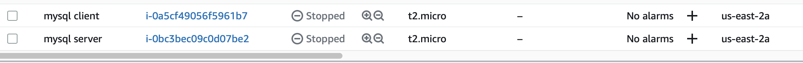

## Project 5 Documentation

### 1. Create and configure two Linux-based virtual servers (EC2 instances in AWS).

### 2. On mysql server Linux Server install MySQL Server software.

### 3. On mysql client Linux Server install MySQL Client software.

### 4. By default, both of your EC2 virtual servers are located in the same local virtual network, so they can communicate to each other using local IP addresses. Use mysql server's local IP address to connect from mysql client. MySQL server uses TCP port 3306 by default, so you will have to open it by creating a new entry in ‘Inbound rules’ in ‘mysql server’ Security Groups. For extra security, do not allow all IP addresses to reach your ‘mysql server’ – allow access only to the specific local IP address of your ‘mysql client’.

### 5. You might need to configure MySQL server to allow connections from remote hosts.

'sudo vi /etc/mysql/mysql.conf.d/mysqld.cnf'

### Create User & Database in my mysql and grant access with privilege

### 6. From mysql client Linux Server connect remotely to mysql server Database Engine without using SSH. You must use the mysql utility to perform this action.

### 7. Check that you have successfully connected to a remote MySQL server and can perform SQL queries:

'Show databases'

